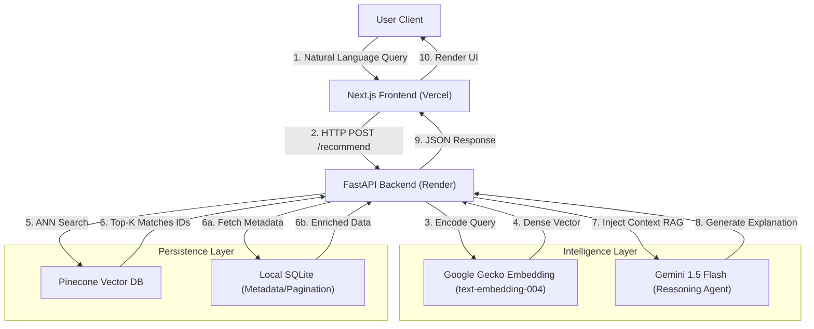

# ScreenScout: Semantic Vector Search & RAG-Powered Recommendation Engine


frontend on:https://cinema-rag.vercel.app/

## Summary
ScreenScout is a **cloud-native, semantic movie discovery engine** that moves beyond traditional keyword matching. Unlike standard collaborative filtering systems (which fail with cold-start users), ScreenScout utilizes **high-dimensional vector embeddings** to understand the *thematic essence* of a user's query.

It features a **Retrieval-Augmented Generation (RAG)** pipeline where a Generative AI agent (Gemini 1.5 Flash) acts as a dynamic curator, explaining *why* a specific film matches the user's "vibe" in real-time.

---

##  System Architecture

The system follows a **3-Tier Microservices Pattern**, ensuring separation of concerns between the Presentation Layer, the Intelligence Layer, and the Data Persistence Layer.

### **Architecture Diagram**



---

##  Tech Stack

| Layer | Technology | Rationale |
| --- | --- | --- |
| **Frontend** | **Next.js 14** (React) | Server-Side Rendering (SSR) for SEO and high-performance image loading (`next/image`). |
| **Backend** | **FastAPI** (Python) | Asynchronous request handling (`async/await`) essential for non-blocking AI inference. |
| **Vector DB** | **Pinecone (Serverless)** | Managed HNSW (Hierarchical Navigable Small World) index for O(log N) retrieval speed. |
| **Embeddings** | **text-embedding-004** | Optimized for semantic textual similarity (STS) via Google GenAI. |
| **LLM** | **Gemini 1.5 Flash** | Low-latency, high-throughput reasoning for real-time user explanations. |
| **Infrastructure** | **Docker & Render** | Containerized deployment via Debian Slim for stability. |

---

## API Documentation

### Base URL: `https://sreenscount-rag-bmhxbshag6gdfeb8.southeastasia-01.azurewebsites.net`

### **1. Semantic Recommendation (RAG)**

Performs vector retrieval and orchestrates the AI explanation.

* **Endpoint:** `POST /recommend`
* **Content-Type:** `application/json`

#### **Request Payload**

> See [mocks/request.json](mocks/request.json) for a full example.

```json
{
  "query": "A sci-fi movie that involves time travel",
  "selected_movie_ids": []
}
```

#### **Response Object**

> See [mocks/response.json](mocks/response.json) for a sample response.

```json
{
  "ai_reasoning": "Based on your request...",
  "movies": [
    {
      "id": "105",
      "title": "Back to the Future",
      "overview": "...",
      "poster_url": "https://image.tmdb...",
      "score": 0.892
    }
  ]
}
```

### **2. Movie Catalog (Pagination)**

Reads directly from the embedded `movies.db` SQLite database to showcase the available catalog.

* **Endpoint:** `GET /movies`
* **Params:** `page` (default 1), `limit` (default 24)

### **3. System Health Check**

* **Endpoint:** `GET /`
* **Response:** `{"status": "online", "mode": "Secure Production"}`

---

##  Development Setup

### **Prerequisites**
* Python 3.11+
* Docker (for containerized run)
* Pinecone API Key
* Google Gemini API Key

### **Run Locally (Python)**

1. **Clone & Install**
   ```bash
   pip install -r requirements.txt
   ```

2. **Set Credentials**
   ```bash
   export PINECONE_KEY="your_key"
   export GEMINI_KEY="your_key"
   ```

3. **Run Server**
   ```bash
   uvicorn main:app --reload
   ```

### **Run with Docker**

1. **Build Image**
   ```bash
   docker build -t screenscout-backend .
   ```

2. **Run Container**
   ```bash
   docker run -p 8000:8000 -e PINECONE_KEY="..." -e GEMINI_KEY="..." screenscout-backend
   ```

### **Testing**
API tests are available via **Bruno**.
* Open Bruno.
* Import the `bruno/` directory.
* Run the collection to verify endpoints.

---

##  License
GPL Open License © 2026 Agrannya Singh | You may fork and use this code in your own projects. howeever then your codebase must be also be copy left complaint i.e open sourced. modification of this codebase is  permitted.
