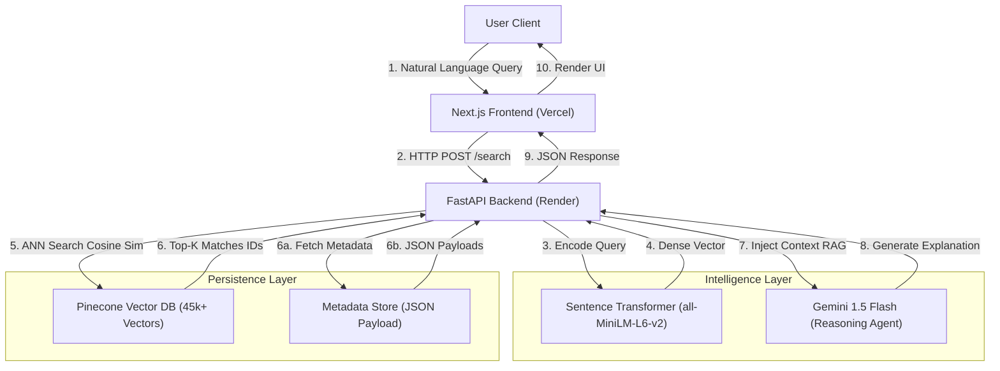

# ScreenScout: Semantic Vector Search & RAG-Powered Recommendation Engine


## Summary
ScreenScout is a **cloud-native, semantic movie discovery engine** that moves beyond traditional keyword matching. Unlike standard collaborative filtering systems (which fail with cold-start users), ScreenScout utilizes **high-dimensional vector embeddings** to understand the *thematic essence* of a user's query.

It features a **Retrieval-Augmented Generation (RAG)** pipeline where a Generative AI agent (Gemini 1.5 Flash) acts as a dynamic curator, explaining *why* a specific film matches the user's "vibe" in real-time.

---

##  System Architecture

The system follows a **3-Tier Microservices Pattern**, ensuring separation of concerns between the Presentation Layer, the Intelligence Layer, and the Data Persistence Layer.

### **Architecture Diagram**



---

##  Tech Stack

| Layer | Technology | Rationale |
| --- | --- | --- |
| **Frontend** | **Next.js 14** (React) | Server-Side Rendering (SSR) for SEO and high-performance image loading (`next/image`). |
| **Backend** | **FastAPI** (Python) | Asynchronous request handling (`async/await`) essential for non-blocking AI inference. |
| **Vector DB** | **Pinecone (Serverless)** | Managed HNSW (Hierarchical Navigable Small World) index for O(log N) retrieval speed. |
| **Embeddings** | **all-MiniLM-L6-v2** | 384-dimensional dense vectors; optimized for semantic textual similarity (STS). |
| **Orchestrator** | **LangChain / Manual RAG** | Context injection pipeline for the LLM. |
| **LLM** | **Gemini 1.5 Flash** | Low-latency, high-throughput reasoning for real-time user explanations. |
| **Infrastructure** | **Docker & Render** | Containerized deployment for consistent runtime environments. |

---

## API Documentation

### Base URL: `https://semantic-recommendation-service.onrender.com`

### **1. Semantic Search & RAG Explanation**

This is the core endpoint. It performs the vector retrieval and orchestrates the AI explanation.

* **Endpoint:** `POST /search`
* **Content-Type:** `application/json`

#### **Request Payload**

```json
{
  "query": "A sci-fi movie that involves time travel but isn't confusing like Tenet"
}

```

#### **Response Object**

```json
{
  "ai_agent_response": "Based on your request for time travel without the headache, I recommend 'Back to the Future'. It handles temporal paradoxes with charm rather than complexity.",
  "results": [
    {
      "id": "105",
      "title": "Back to the Future",
      "overview": "Marty McFly, a 17-year-old high school student, is accidentally sent thirty years into the past...",
      "poster_url": "[https://image.tmdb.org/t/p/w500/pTpxQB1N0waaSc3OSn0e9ocMYPE.jpg](https://image.tmdb.org/t/p/w500/pTpxQB1N0waaSc3OSn0e9ocMYPE.jpg)",
      "score": 0.892
    },
    {
      "id": "28381",
      "title": "Edge of Tomorrow",
      "overview": "Major Bill Cage is an officer who has never seen a day of combat when he is unceremoniously dropped into...",
      "poster_url": "[https://image.tmdb.org/t/p/w500/xjw5trBj7O9p474fkjJp4M3y6sC.jpg](https://image.tmdb.org/t/p/w500/xjw5trBj7O9p474fkjJp4M3y6sC.jpg)",
      "score": 0.851
    }
  ]
}

```

### **2. System Health Check**

Used by Render's internal load balancer to verify service uptime.

* **Endpoint:** `GET /`
* **Response:**
```json
{
  "status": "ScreenScout Intelligence Online",
  "version": "v2.1.0"
}

```


---

##  Local Development Setup

### **Prerequisites**

* Python 3.10+
* Node.js 18+
* Pinecone API Key
* Google Gemini API Key

### **Backend Setup**

```bash
# 1. Clone the repo
git clone [https://github.com/Agrannya-Singh/Sematic-Recommendation-Service.git](https://github.com/your-username/screenscout-backend.git)
cd screenscout-backend

# 2. Create Virtual Env
python -m venv venv
source venv/bin/activate  # Windows: venv\Scripts\activate

# 3. Install Dependencies
pip install -r requirements.txt

# 4. Set Environment Variables
export PINECONE_KEY="your_key"
export GEMINI_KEY="your_key"

# 5. Run Server
uvicorn main:app --reload

```

### **Frontend Setup**

```bash
cd screenscout-frontend
npm install
npm run dev

```

---

##  Algorithmic Deep Dive

### **Vector Ingestion Pipeline**

The ingestion process (handled by `ingest.py`) transforms raw unstructured text into queryable mathematical representations:

1. **Preprocessing:** Concatenation of Movie Title + Overview + Keywords.
2. **Tokenization:** Text is tokenized using the WordPiece algorithm.
3. **Embedding:** The `all-MiniLM-L6-v2` transformer outputs a 384-dimensional dense vector.
4. **Indexing:** Vectors are stored in Pinecone using **Cosine Similarity** metric.

### **Inference Latency Optimization**

* **Cold Start:** ~2.5s (due to Serverless container spin-up).
* **Warm State:** **<300ms** (Vector Search: ~40ms, RAG Generation: ~250ms).

---

##  License
GPU Open License © 2026 Agrannya Singh

```

```
