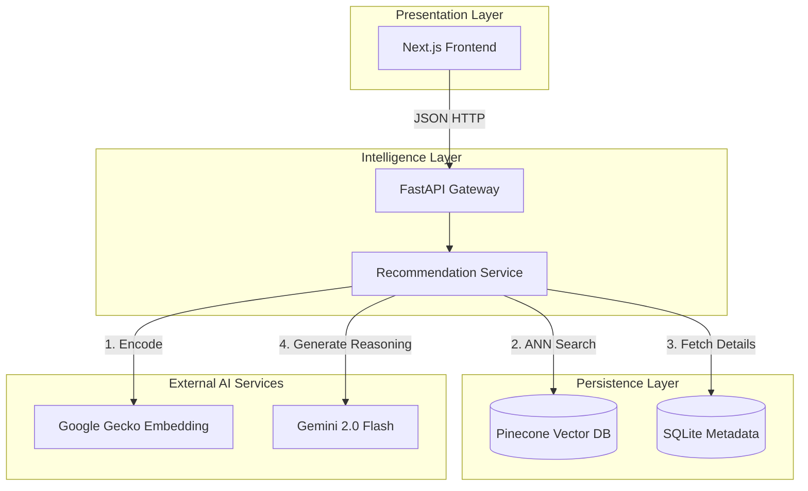
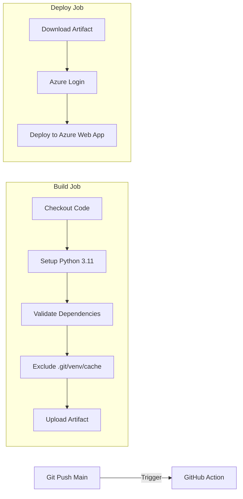

# Whitepaper: ScreenScout – Semantic Vector Search & RAG-Powered Recommendation Engine

## 1. Executive Summary

ScreenScout is a cloud-native, event-driven recommendation engine designed to address the "cold start" problem inherent in traditional collaborative filtering systems. By leveraging **High-Dimensional Vector Embeddings** and a **Retrieval-Augmented Generation (RAG)** pipeline, ScreenScout shifts movie discovery from rigid keyword matching to semantic "thematic essence" understanding. This document outlines the system's 3-tier microservices architecture, engineering trade-offs, and the automated CI/CD pipeline that ensures reliable delivery.

---

## 2. System Architecture: 3-Tier Microservices Pattern

ScreenScout adopts a strict separation of concerns via a **3-Tier Architecture**, ensuring that the presentation, intelligence, and persistence layers scale independently.

### 2.1 Layer Breakdown

* **Presentation Layer (Client):** Built with **Next.js 14**, utilizing Server-Side Rendering (SSR) for optimized SEO and rapid content painting. It remains stateless, interacting with the backend purely via REST APIs.
* **Intelligence Layer (Application Server):** A **FastAPI** (Python) service that orchestrates AI inference. The asynchronous nature of FastAPI (`async/await`) is critical for handling non-blocking I/O operations during external AI calls.
* **Persistence Layer (Polyglot Storage):**
* **Vector Store:** **Pinecone (Serverless)** stores 768-dimensional dense vectors for Approximate Nearest Neighbor (ANN) search.
* **Metadata Store:** **SQLite** manages structured data (titles, pagination, poster URLs) to keep the vector index lightweight.

### 2.2 Architecture Diagram

---

## 3. Architecture Design Trade-offs

### 3.1 Managed Vector Search (Pinecone) vs. Self-Hosted (FAISS/pgvector)

* **Decision:** Adopted **Pinecone Serverless**.
* **Trade-off:** While self-hosting FAISS or using PostgreSQL's `pgvector` offers granular cost control, it introduces significant operational overhead regarding index scaling and memory management.
* **Rationale:** Pinecone provides a managed HNSW (Hierarchical Navigable Small World) index, guaranteeing  retrieval speeds and allowing the team to focus on application logic rather than infrastructure maintenance.

### 3.2 Dynamic RAG vs. Pre-computed Matrix Factorization

* **Decision:** **Dynamic RAG (Real-time).**
* **Trade-off:** Pre-computing recommendations is computationally cheaper and faster at query time but fails to capture real-time user intent or nuanced natural language queries.
* **Rationale:** To support queries like *"A sci-fi movie that feels like Inception,"* the system must generate embeddings on the fly. The slight latency cost is mitigated by FastAPI's concurrency and is acceptable for the superior user experience of semantic discovery.

### 3.3 Hybrid Database Model

* **Decision:** **Decoupling Vector and Metadata storage.**
* **Rationale:** Storing full metadata (plots, posters, ratings) in the Vector DB balloons index size and latency. By keeping the Pinecone index "thin" (IDs + Embeddings) and hydrating data from a local SQLite instance, ScreenScout minimizes API payload sizes and cloud costs.

---

## 4. RAG Implementation: The Intelligence Pipeline

The core of ScreenScout is its Retrieval-Augmented Generation (RAG) pipeline, implemented within `app/services/recommendation.py`.

### Phase 1: Contextual Query Augmentation

The system constructs a "Composite Query" by combining the user's immediate prompt with their selected history.

* **Logic:** `augmented_query = f"Movies similar to {selected_titles}. Context: {req.query}"`.
* **Benefit:** This guides the vector search to respect historical preferences while addressing the new specific request.

### Phase 2: Dual-Stage Retrieval

1. **Embedding:** The augmented query is sent to Google's `text-embedding-004` model to generate a 768-dimension vector.
2. **ANN Search:** This vector is queried against the Pinecone index with `top_k=40` to retrieve a broad set of candidates based on cosine similarity.

### Phase 3: Generative Reasoning

The retrieved candidates are passed to the **Gemini 2.0 Flash** agent. The system injects these candidates into a strict prompt template, instructing the LLM to:

1. Analyze the user's specific intent.
2. Filter the top 5 matches from the retrieval set.
3. Generate a JSON response explaining *why* the movie fits the user's "vibe".

---

## 5. CI/CD Pipeline & Deployment Strategy

ScreenScout utilizes a robust Continuous Integration/Continuous Deployment (CI/CD) pipeline via **GitHub Actions** to ensure reliable production releases to Azure Web Apps.

### 5.1 Pipeline Workflow

The workflow is defined in `.github/workflows/main_sreenscount-rag.yml` and consists of two primary jobs:

1. **Build Job:**
* **Environment Setup:** Initializes Python 3.11.
* **Dependency Validation:** Creates a virtual environment and installs `requirements.txt` to verify dependency integrity before deployment.
* **Artifact Slimming:** To prevent "Zip Deploy Failed" errors and reduce cold starts, the pipeline explicitly excludes development artifacts (`.git`, `venv`, `__pycache__`, `tests`) during the upload process.

2. **Deploy Job:**
* **Authentication:** Authenticates with Azure using a Service Principal via `azure/login`.
* **Release:** Deploys the slimmed artifact to the `sreenscount-rag` Azure Web App.

### 5.2 CI/CD Diagram

